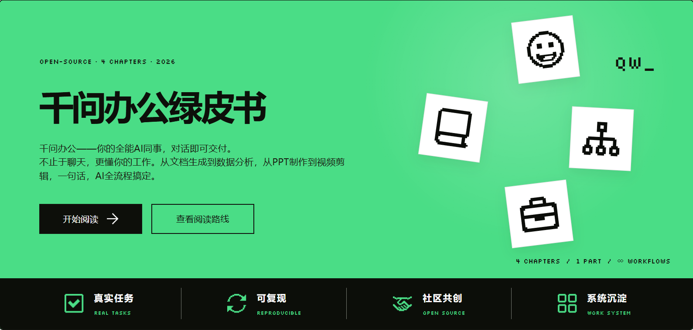

<p align="center">
  <a href="https://qwenwork.ink/">
    
  </a>
</p>

<h1 align="center">QwenWork Guide (QwenWork Greenbook)</h1>

<p align="center"><strong>A hands-on Chinese user manual for QwenWork</strong></p>

<p align="center">
  English · <a href="./README.md">简体中文</a> ·
  <a href="https://qwenwork.ink/">Read Online</a> ·
  <a href="https://github.com/wangxiaoshuai1998/QwenWorkGuide/tree/main/docs/cases">Community Cases</a> ·
  <a href="https://github.com/wangxiaoshuai1998/QwenWorkGuide/tree/main/docs/help">Help</a> ·
  <a href="./docs/reading-guide.md">Reading Guide</a> ·
  <a href="https://github.com/wangxiaoshuai1998/QwenWorkGuide/blob/main/CONTRIBUTING.md">Contribute</a>
</p>

> This is a task-driven field guide, not a rewritten feature manual. The current release covers Part I · User Manual (part introduction + Chapters 1–4): getting to know QwenWork, the web workflow, the desktop workflow, and general settings. More parts will be published continuously.

## Background

This project originates from the open-source QwenWork Greenbook ([wangxiaoshuai1998/QwenWorkGuide](https://github.com/wangxiaoshuai1998/QwenWorkGuide)) and has been rebuilt on top of its site framework as the QwenWork Guide. The book content is exported from a DingTalk knowledge base and maintained around real QwenWork workflows.

## Read Online

The recommended reading experience is **[qwenwork.ink](https://qwenwork.ink/)**. The website provides full navigation, local search, page outlines, dark mode, rendered diagrams, and mobile support.

The book is currently written primarily in Simplified Chinese. English contributions and translation proposals are welcome.

## What Is Inside

Currently available: **Part I · User Manual (part introduction + Chapters 1–4)**. More parts are on the way.

| Chapter | Topics |
| --- | --- |
| Part Introduction | Reading paths, chapter overview, and learning goals |
| Ch. 1 Getting to Know QwenWork | Core capabilities, differences from plain AI chat, and typical scenarios |
| Ch. 2 Web Workflow | Signing in, creating tasks, multi-turn collaboration, cloud drive, and web publishing |
| Ch. 3 Desktop Workflow | Download, installation, sign-in, interface tour, and the first local task |
| Ch. 4 General Settings | Profile, language and appearance, subscription, and credit management |

## How to Read

- **New to QwenWork**: start with Chapter 1 and complete Part I in order.
- **Want to get hands-on quickly**: jump to Chapter 2 (web) or Chapter 3 (desktop), finish a first task, then fill in the rest.
- **Looking for more**: future parts (cases, advanced topics) will be published continuously—watch this repository for updates.

A more complete reading path is available in [How to Read This Guide](./docs/reading-guide.md).

## Tech Stack

- **VitePress** v1.6.4 — Static site generator
- **Vue 3** — Frontend rendering foundation (implicit dependency of VitePress)
- **Mermaid** — Flowchart and diagram rendering
- **Algolia DocSearch** — Site-wide search
- **Node.js** 22 (recommended)

## Local Development

Node.js 20–24 is supported; Node.js 22 is recommended.

```bash
npm install
npm run dev
```

Build and preview the static site:

```bash
npm run docs:build
npm run docs:preview
```

## Deployment

The site is deployed using **VitePress + Cloudflare Pages + GitHub Pages**.

- **Cloudflare Pages**: connected to the `main` branch, auto-builds and deploys on every push
- **Build command**: `npm run docs:build`
- **Output directory**: `docs/.vitepress/dist`
- **Node.js version**: 22

See [DEPLOYMENT.md](./DEPLOYMENT.md) for detailed configuration.

## Contributing

Contributions are welcome, including:

- corrections for typos, broken links, and outdated information;
- reproducible real-world QwenWork cases;
- Skills, connectors, API, and automation practices;
- role-specific and industry-specific workflows;
- improvements to navigation, search, design, and accessibility;
- English translations.

Read the [Contribution Guide](https://github.com/wangxiaoshuai1998/QwenWorkGuide/blob/main/CONTRIBUTING_en.md) or open an [Issue](https://github.com/wangxiaoshuai1998/QwenWorkGuide/issues).

## Community

Join the QwenWork community discussion — contact **wangxiaoshuai** (note: QwenWork Co-creation).

After preparing or submitting a PR, you can also connect through the website to discuss topic ideas and get feedback on your contributions.

For questions or suggestions, feel free to open an [Issue](https://github.com/wangxiaoshuai1998/QwenWorkGuide/issues).

## Authors

Thanks to the authors who created and maintain the upstream QwenWork Guide ([wangxiaoshuai1998/QwenWorkGuide](https://github.com/wangxiaoshuai1998/QwenWorkGuide)). Click the card to view the full-size image and scan its QR code.

<p align="center">
  <a href="./assets/authors/wangxiaoshuai.jpg"></a>
</p>

## Disclaimer

This is a community-maintained QwenWork practice guide. For time-sensitive product details—including features, UI, pricing, availability, and security policies—refer to official QwenWork sources.

## License

This project is licensed under the [MIT License](./LICENSE). You may use, copy, modify, and distribute it, provided that the original copyright notice and license text are retained.
