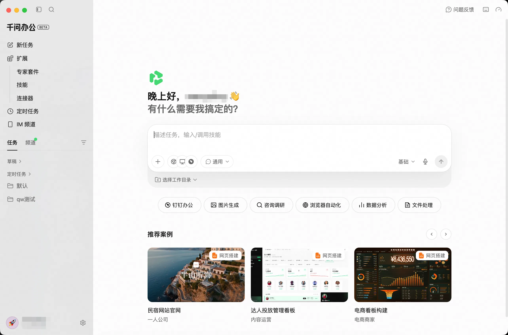

image.png

QwenWork 桌面端是一款面向日常办公场景的 AI 智能工作台。用户可以通过自然语言发起任务，结合文件、技能、连接器、电脑操控能力、IM、Hooks等功能，完成信息整理、内容创作、数据分析等工作，减少应用切换，提高任务处理效率。

***来源：千文办公 官方指南。***

## 子页面

- [6.1 系统设置](6.1%20%E7%B3%BB%E7%BB%9F%E8%AE%BE%E7%BD%AE/index.md)
- [6.2 意识](6.2%20%E6%84%8F%E8%AF%86/index.md)
- [6.3 应用快照](6.3%20%E5%BA%94%E7%94%A8%E5%BF%AB%E7%85%A7/index.md)
- [6.4 电脑操控](6.4%20%E7%94%B5%E8%84%91%E6%93%8D%E6%8E%A7/index.md)
- [6.5 模型选择](6.5%20%E6%A8%A1%E5%9E%8B%E9%80%89%E6%8B%A9/index.md)
- [6.6 语音输入](6.6%20%E8%AF%AD%E9%9F%B3%E8%BE%93%E5%85%A5/index.md)
- [6.7 IM 频道](6.7%20IM%20%E9%A2%91%E9%81%93/index.md)
- [6.8 定时任务](6.8%20%E5%AE%9A%E6%97%B6%E4%BB%BB%E5%8A%A1/index.md)
- [6.9 Hooks](6.9%20Hooks/index.md)
- [6.10 连接器](6.10%20%E8%BF%9E%E6%8E%A5%E5%99%A8/index.md)
- [6.11 技能](6.11%20%E6%8A%80%E8%83%BD/index.md)
- [6.12 专家套件](6.12%20%E4%B8%93%E5%AE%B6%E5%A5%97%E4%BB%B6/index.md)
