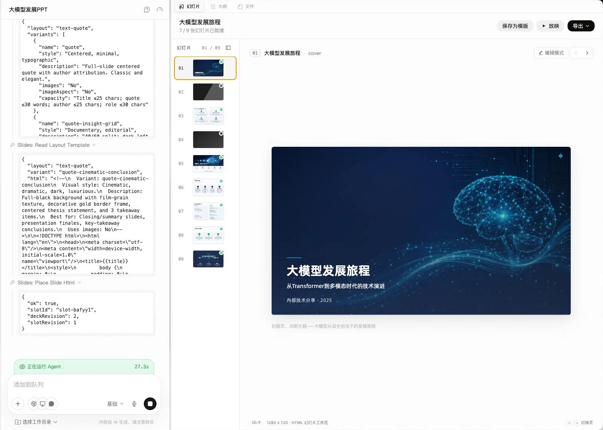
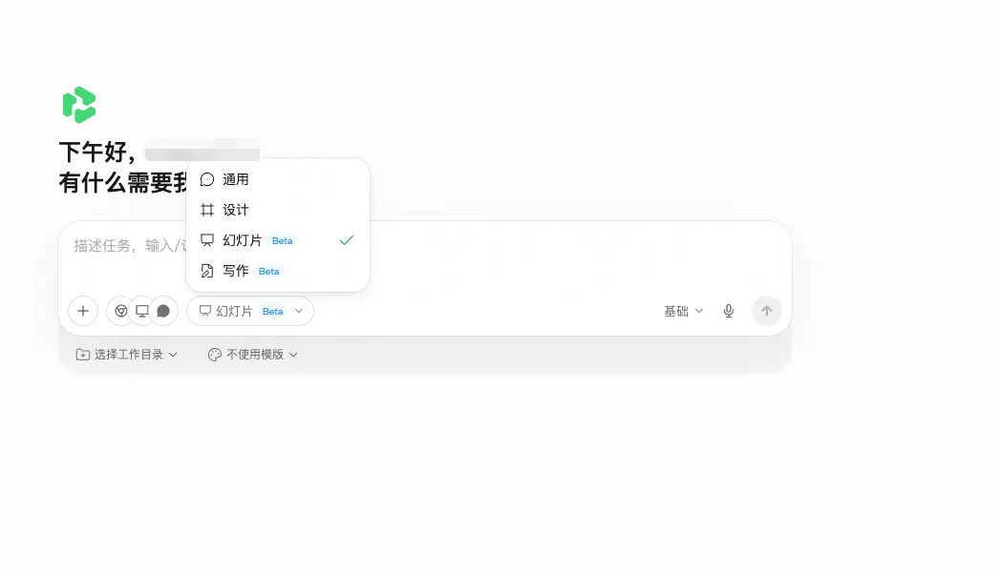
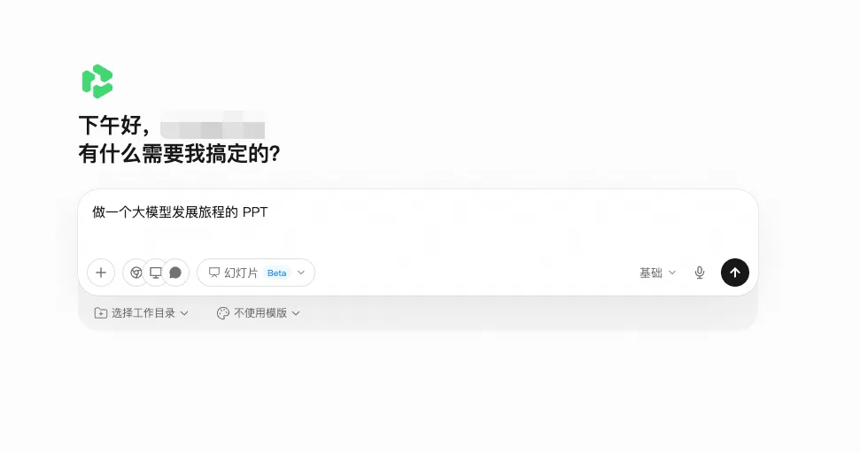
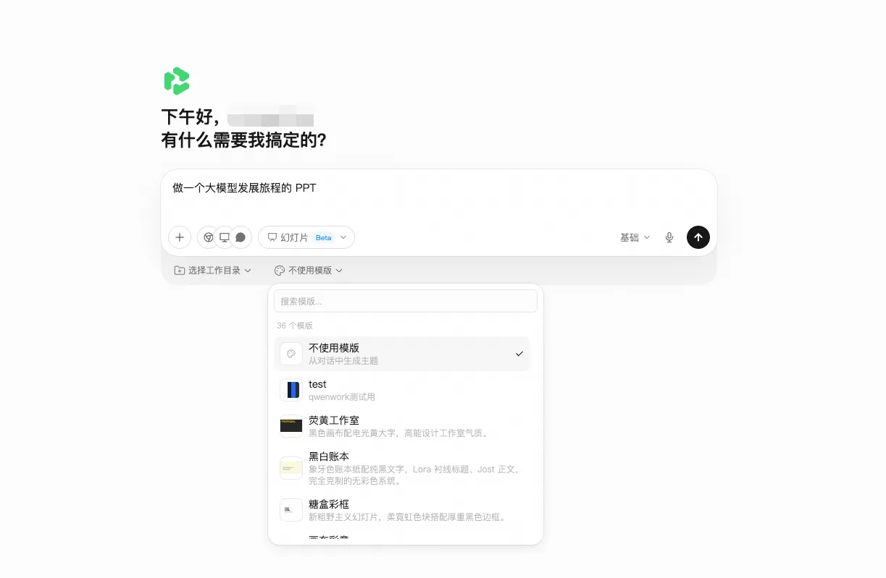
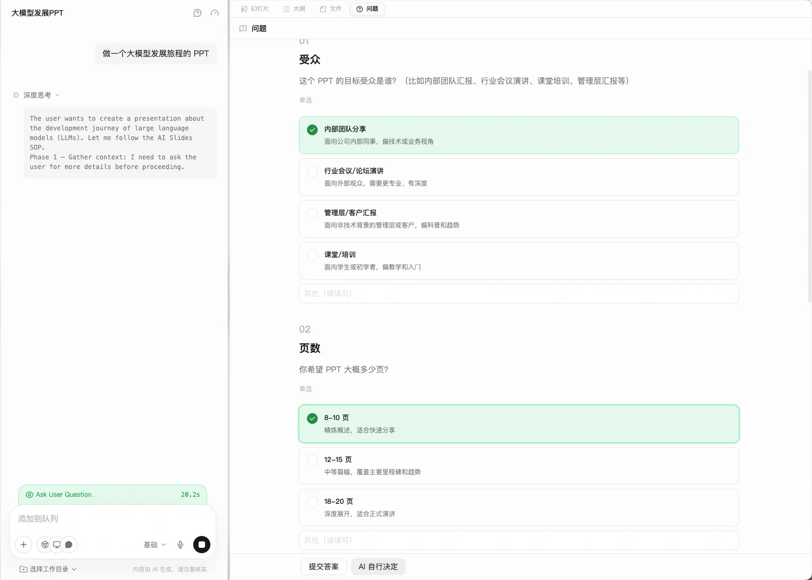
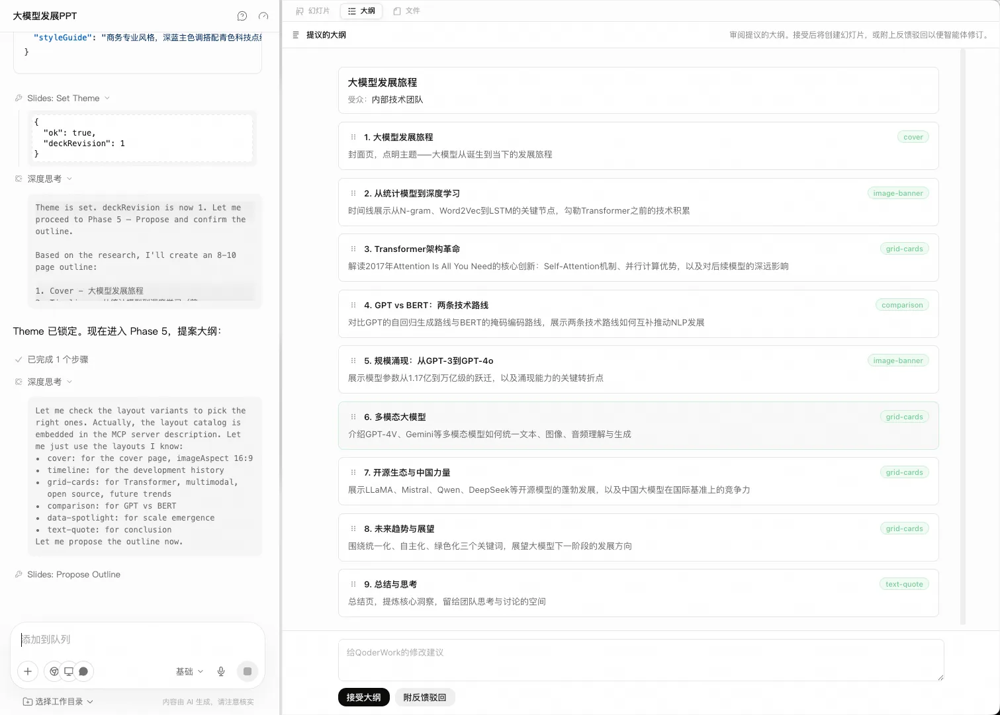
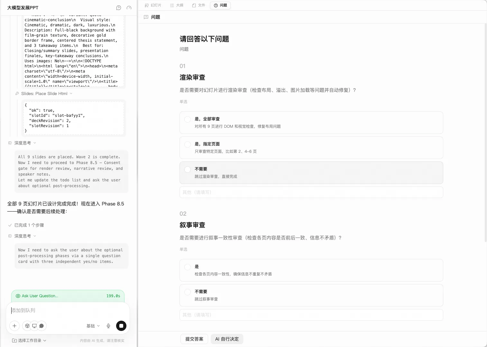

# **6.14 工作台-幻灯片**

# **幻灯片**

幻灯片工作台是面向幻灯片创作的垂类工作台。切换工作台模式并发送请求后，右侧画布会变成专为幻灯片设计的 HTML 画布。

## **工作区**

右侧画布提供 3 个标签：

| **标签** | **用途** |
|---------------------------------------------------------------------------------------------|---------------------------------------------------------------------------------------------|
| 幻灯片 | 渲染好的幻灯片，可左右切换 |
| 大纲 | Agent 用于驱动生成的大纲，需要先确认大纲再生成幻灯片 |
| 文件 | 幻灯片背后的源文件 |

画布默认是 16:9 的 HTML 幻灯片工作区（1280 × 720），通过右下角的左右箭头或键盘左右键切换页面。

## **创建幻灯片**

切换到幻灯片工作台

在输入框点击工作台切换器（默认 通用），选 幻灯片。

**示例**

默认工作台可以在 QwenWork 设置里调整——主要做幻灯片时，把"幻灯片"设为默认更顺手。

描述需求

描述主题、受众和你想要的结构。例如：*"做一个大模型发展旅程的 PPT。"*

也可以点击麦克风使用 \[语音输入\]

挑选模版、固定工作目录（可选）
- 点击输入框下方的「不使用模版」按钮，可以从 35 个内置模版中挑一个作为视觉基调；不选也可以让 Agent 从对话中自动生成主题。
- 点击「选择工作目录」可把任务绑定到本地一个目录——Agent 会把幻灯片源文件落到该目录下，方便长期管理与协作。

回答 Agent 的澄清问题

Agent 在开工前会就受众、页数、语言等关键参数提几个问题。逐题作答可以让 deck 更贴合你的实际场景；如果不想逐项确认，也可以直接点击底部的「AI 自行决定」。

确认大纲

回答完问题后，Agent 会在 大纲 标签下输出一份大纲，每节带一句简介和一个版式标签（封面页、文字大纲、左图右文、双栏、引文等）。点击 接受大纲 创建幻灯片占位；如果对结构或节奏不满意，点 附反馈驳回 让 Agent 在开页之前先调整。

查看幻灯片生成过程

确认大纲后，Agent 会创建幻灯片占位并按页填充。中间面板显示页码与缩略图（`幻灯片 — N / N`），右侧面板渲染当前页。这一阶段基本无需介入——可以离开喝杯水后再回来；如果某页明显偏离预期，也可以在底部输入框追加指令让 Agent 改完当前页再继续。

选择后处理选项（可选）

全部页面合成完成后，Agent 会问是否运行后处理步骤——可多选，也可全部跳过直接完成。

查看最终成果

所有页面就绪后，画布顶部显示「N / N 张幻灯片已就绪」。右上角「保存为模版 / 放映 / 导出」可直接进入下一步；左侧缩略图列可点选任意页跳转、右侧画布渲染当前页。

## **继续迭代**
- 追加任务：在底部输入框继续追加指令，例如  *"换成对比表格的版式"*——Agent 会在当前步完成后接着处理。
- 打断当前生成：输入框旁的停止按钮可以中断生成。
- 切换标签查看：切换到 大纲 复盘结构，或切换到 文件 检查源文件。
- 中途切换模型：输入框旁的模型下拉（例如 标准）可以为下一步切换模型。

**说明**

好的需求往往同时点出"受众"和"想让对方记住什么"，而不仅仅是主题。*"给工程团队的 5 分钟内部 sync：本周交付了什么、下周聚焦什么、一个待支持事项"*  比  *"写个周会 PPT"*  落地效果好得多。

## **放映、导出、保存为模版**

右上角提供三个动作：
- 放映：切换到全屏演示模式，适合现场 demo 与评审。
- 导出：支持 PPTX、PDF、HTML 三种格式下载。
- 保存为模版：把当前幻灯片保存为模板，便于后续复用。

## **典型场景**

### **内部评审 PPT**

**注意**

做一份 10 页的工程团队周会内部评审 deck。 内容包括：本周交付（3 项）、进行中（2 项）、风险与待办（1 页）、 下周聚焦。整体使用克制的单色调版式。

### **把文档转成大会演讲**

**示例**

@design-launch.md 把这份发布文档转成一份 18 页、15 分钟的大会演讲稿。 开篇先讲问题，中段安排一个 demo，结尾给出 call to action。

### **快速产出对外提案**

**说明**

做一份 8 页的合作提案 deck。 受众：企业 BD 负责人。调性：自信、用证据说话。 结构：问题、我们的切入角度、证据点、最终诉求。

### **培训课件**

**说明**

做一份 20 页的新员工入职培训课件。 内容包括：公司简介、组织架构、产品线概览、 开发流程与工具链、团队文化、常见 FAQ。 每 3-4 页插入一个互动问答环节的页面。 风格：轻松友好，使用品牌色。

### **产品演示 Deck**

**说明**

@product-features.md 基于这份功能清单，做一份 12 页的产品演示 Deck。 受众：潜在客户的技术决策者。 结构：痛点引入 → 产品概览 → 3 个核心功能演示（每个 2 页）→ 竞品对比 → 客户案例 → 下一步。附上演讲者备注。

***来源：千文办公 官方指南。***
