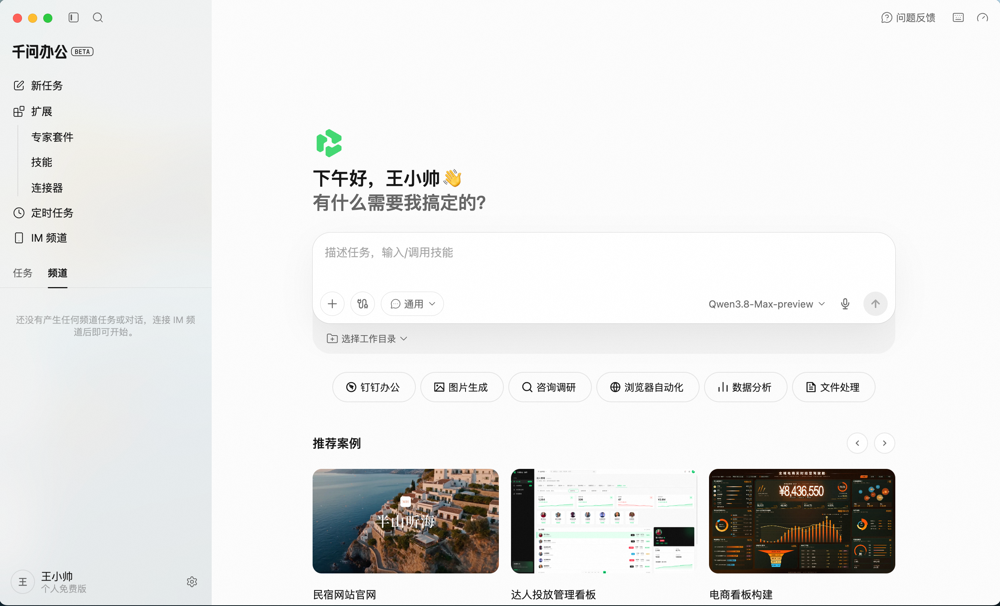
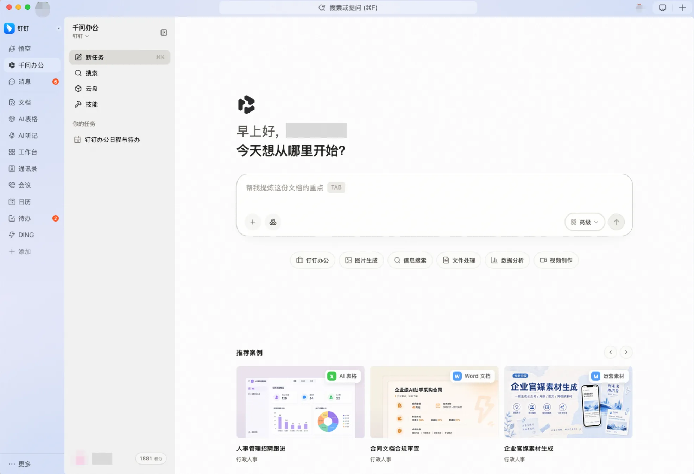
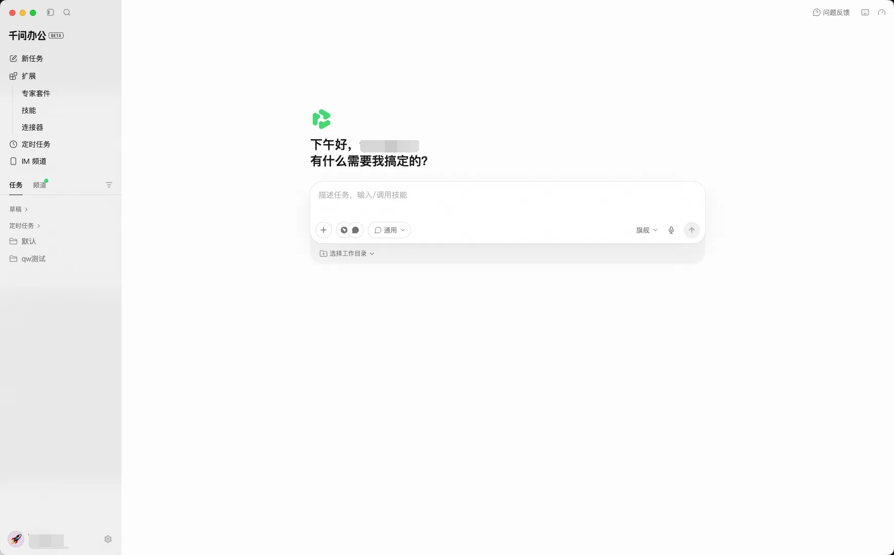
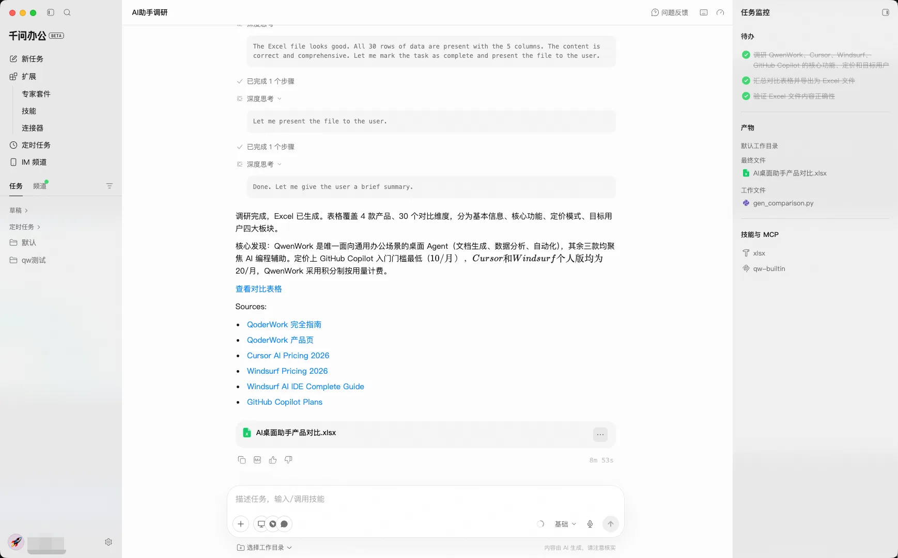
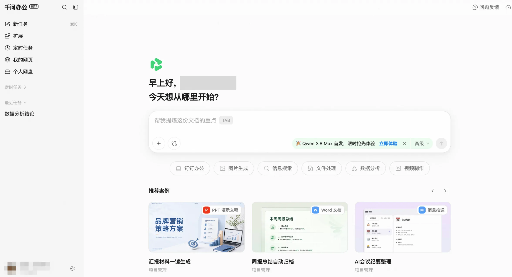

# **千问办公简介**

千问办公是阿里巴巴全新推出的一站式 AI 办公平台，不止于对话，更注重交付——用户仅需一句话，即可完成数据分析、PPT生成、视频剪辑、网页搭建等复杂任务，直接获得可用成果。目前已全面覆盖桌面端、网页端，并深度接入钉钉生态，依托个人云盘、IM、连接器等模块打通数据与设备，让AI真正融入工作流，随时随地响应办公需求。

### **核心能力**
- 旗舰模型驱动：基于千问系列大模型，拥有百万级超长上下文记忆、原生多模态感知能力，以及业界领先的代码生成与理解能力，为复杂办公任务提供强劲的智能内核。支持多模态内容理解，满足多种创作任务的需求。
- 全链路交付能力：从对话指令到成品输出，全流程一站式闭环。无需切换工具，AI直接交付可用的文档、表格、PPT及代码，真正做到“生成即所得”。
- 多端覆盖，钉内深度融合：已全面覆盖桌面端与网页端，同时提供钉钉内部便捷入口。无论在哪一端启动，均可无缝衔接，随时随地响应办公需求。
- 核心能力支撑：依托个人云盘、IM、技能套件、连接器等模块，实现跨设备数据互通与场景互联。同时内置海量专业领域数据，精准适配用户在不同行业、岗位下的深度办公场景。
- 网页全栈制作：支持制作可交互网页，并可根据需要连接数据库，无需复杂部署即可使用。目前已支持网页版和钉钉端，客户端即将开放。
- 云端定时任务：支持任务按设定时间在云端自动运行，并将执行结果推送至钉钉消息等指定渠道。
- 浏览器自动化：可执行网页点击、输入和信息采集等操作，适用于数据整理、重复操作等场景。该能力目前仅客户端支持。

### **与传统AI对话的区别**

| **传统 AI 对话** | **千问办公** |
|-------------------------------------------------------------------------------------------------------|---------------------------------------------------------------------------------------------------|
| 主要回答问题 | 拆解任务并执行，支持多步骤复杂任务 |
| 输出文字为主 | 可交付 PPT、Word、Excel、网页、报告、代码、多媒体等结果 |
| 需要人工复制粘贴、手动执行 | 可操作钉钉、本地文件、浏览器自动化等手段执行任务 |
| 难沉淀复用，需要反复输入指令 | 可通过技能、记忆、定时任务沉淀为可复用流程 |

### **典型场景**
- 钉钉日常办公：邮件编辑、周报生成等钉内协同办公场景
- 电商场景提效：获取电商数据，生成电商素材，分析电商后台数据。
- 教育培训辅助：生成多类型教培材料，精细化教学
- 营销素材制作：丰富多模态模型批量生成高质量图片和视频
- 财务商业分析：上传数据文件，自动完成复杂分析和可视化报告
- 市场研究调研：对竞品信息或市场动态进行深度调研并输出报告

## **多端适配，无缝衔接**

### **钉内无缝衔接钉钉生态与企业OA系统，全面覆盖日常办公场景。**

用户在钉钉工作台内可直接唤起千问办公，无需额外跳转或单独登录。AI原生的数据分析、PPT生成、视频剪辑、网页搭建等核心能力，在钉内即可完整调用。用户通过自然语言对话，即可让AI处理文档、提炼信息、生成内容或完成创作任务，所有操作在钉钉界面内闭环完成。AI深度理解对话上下文，支持多轮交互与任务迭代优化，让办公协作更智能、更高效。

image.png

### **提供桌面端，打通您的本地文件系统，与您的办公场景无缝衔接。**

image.png

image.png

在官网下载并登录千问办公桌面端后，用户可直接读取本地磁盘中的文档、表格、图片、视频等文件，无需重复上传或导入。AI可对本地文件直接分析，包含总结PDF、润色Word、提取Excel数据、生成PPT或剪辑视频，处理完成后一键保存至原路径或指定文件夹。操作逻辑与本地软件完全一致，支持拖拽、右键菜单等原生交互，大幅降低学习成本，让云端AI能力像本地软件一样随手可用。

### **网页端即开即用，通过浏览器随时随地、开启办公。**

image.png

无需下载安装，在任意设备的浏览器中访问千问办公网页版（qwenwork.cn），使用钉钉账号或手机号登录即可快速开启工作。无论是出差途中、临时更换设备，还是处理紧急任务，用户都能随时进入工作状态，便捷使用千问办公 Web端提供的核心功能与专业能力。

## **千问办公——你的全能AI同事，对话即可交付。**

不止于聊天，更懂你的工作。从文档生成到数据分析，从PPT制作到视频剪辑，一句话，AI全流程搞定。
