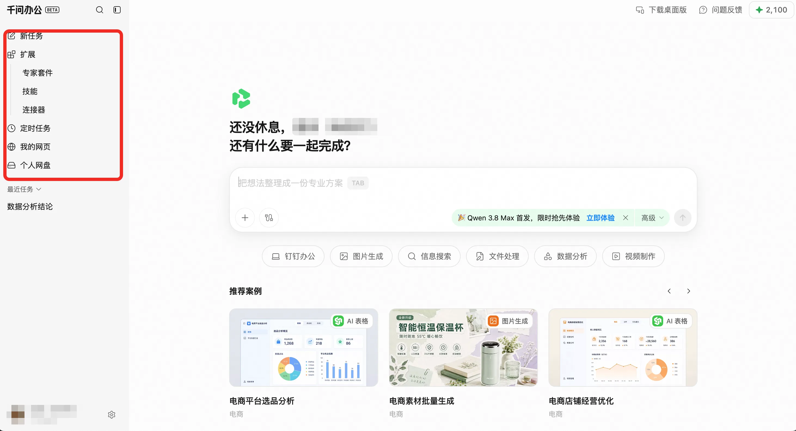
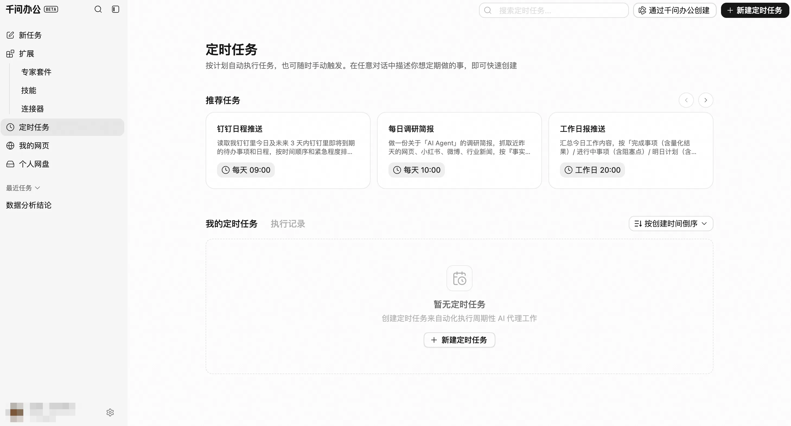

千问办公网页端以 AI 任务执行为核心，为个人和企业用户提供覆盖内容创作、文件处理、数据分析、信息研究与流程自动化的一站式办公体验。用户只需通过自然语言描述目标，系统即可理解需求、拆解步骤并执行任务，最终交付 Word、Excel、PPT、PDF、网页、报告、代码及多媒体内容等可直接使用的成果，减少在多个工具之间切换以及重复复制、整理和操作的成本。

核心能力包括：
- 即开即用的智能办公体验：无需下载安装，通过浏览器即可使用千问办公，快速发起内容创作、数据分析、信息检索和复杂任务处理。
- 旗舰模型能力支撑：基于千问系列大模型，具备超长上下文处理、原生多模态理解及代码生成能力，可处理文本、图片、音视频和数据文件等多种内容。
- 从需求到成果的一站式交付：用户只需通过自然语言描述目标，即可获得可直接使用的 Word、Excel、PPT、报告、网页及代码等成果，减少工具切换和人工整理。
- 网页全栈制作：支持创建可交互网页，并可根据业务需求连接数据库，无需复杂的开发和部署流程，即可完成网页内容制作与发布。
- 云端任务自动运行：支持设置定时任务，即使关闭浏览器，任务仍可按计划在云端执行，并将结果保存在任务会话中或推送至指定渠道。
- 办公资源统一管理：通过我的网页、我的网盘等功能集中管理网页成果和任务文件，便于后续查找、调用和复用。
- 技能与连接器扩展：可通过技能调用专业工作流，通过连接器接入钉钉及其他外部平台和数据，满足不同岗位与业务场景下的办公需求。
- 钉钉生态协同：结合钉钉文档、消息、知识库、AI 听记等能力，实现信息获取、任务执行和结果交付的协同闭环。

千问办公 Web 端将模型、文件、技能、连接器与定时任务等能力集中在统一的工作空间中，帮助用户从自然语言需求出发，完成任务拆解、内容生成、数据处理和成果交付。用户可根据实际场景灵活组合各项能力，将一次性操作沉淀 为可复用、可持续执行的工作流程。

不同账号、版本及授权范围支持的功能可能有所差异，具体以产品页面和最新官方说明为准。

# **平台功能**

千问办公 Web 端围绕内容管理、能力扩展、任务自动化和企业管理提供完整的办公支持。本期网页端主要提供以下核心功能：
- 我的网页：用于管理用户在与AI交互过程中生成的网页
- 我的网盘：存储和文件管理
- 扩展：包含专家套件、技能与连接器。
- 定时任务：重复执行任务
- 企业后台：支持企业对成员进行用量管控和组织管理。

image.png

用户可以通过「我的网盘」集中存储、管理和调用任务文件，可通过「我的网页」查看、编辑和管理已创建的网页成果，并将常用内容持续沉淀和复用。此外，平台支持用户通过「扩展」安装专家套件、技能和连接器：专家套件提供面向特定岗位或场景的完整能力组合，技能用于执行专业化工作流，连接器则负责接入外部平台、账号和数据。用户在使用云端AI时，还可以通过「定时任务」将重复工作交由系统在云端自动执行。

对于企业用户，企业管理员可在企业后台统一管理组织成员、权限、订阅及相关企业资源。

# **扩展：专家套件、技能与连接器**

## **一、功能简介**

扩展是 QwenWork 的能力资源中心，你可以在这里查找并安装所需资源，让 QwenWork 协助你完成更多专业任务，或连接外部平台、账号、数据和工具。

扩展目前提供以下三类资源：
- 专家套件（Expert Kit）：针对特定岗位或工作场景整理的一组专业能力，可能包含多个技能和连接器。适合希望一次获得一套完整工作能力的用户。
- 技能（Skill）：预定义的专业化工作流，用于处理特定类型的任务，例如内容创作、数据分析或信息整理。你可以把它理解为 QwenWork 的“专业工具”。
- 连接器（Connector）：用于连接外部平台、账号、数据或工具。部分连接器安装后还需要完成配置或账号授权。

## **二、浏览和查找资源**

在应用首页的侧边栏中点击 扩展 ，浏览广场上的多种技能资源。

用户可以通过以下方式查找自己需要的资源资源：
- 在扩展中的 专家套件、技能、连接器 标签之间切换，浏览不同类型的资源。
- 选择行业或主题分类，快速筛选符合当前需求的资源。
- 在搜索框中输入名称或关键词。搜索支持关键词的部分匹配，结果会实时显示。
- 点击资源卡片进入详情页，查看资源介绍和相关信息。

## **三、安装和使用资源**

### **安装资源**
1. 在扩展中找到需要的专家套件、技能或连接器。
2. 点击资源卡片进入详情页，确认资源介绍及相关信息。
3. 点击页面中的安装或使用入口，将资源添加到 QwenWork。

安装成功后，可以在 我的安装 中查看该资源，也可以在主聊天框的 添加资源 列表中找到它。

### **在对话中使用资源**

安装后，可以通过以下方式使用资源：
- 在主聊天框的 添加资源 列表中手动选择所需资源，然后描述你的任务。
- 在对话中直接描述需求，由 QwenWork 在合适时使用已安装的资源。
- 部分技能提供预设的任务输入。点击使用后，可按照页面提示补充信息并快速发起任务。

不同类型资源安装后的使用方式有所不同：

技能：安装后通常可以直接选择使用。

专家套件：套件中如果包含连接器，可能需要先完成相关配置或授权。

连接器：安装后可能需要填写必要参数或授权外部账号，完成后才能使用。

授权或配置时，请按照页面提示操作。具体要求取决于所连接的外部服务。

## **四、管理已安装的资源**

进入 我的安装，可以查看已经安装的专家套件、技能和连接器，并根据页面提供的操作进行使用或管理。

### **更新专家套件**

专家套件由其创作者持续更新和维护。当新版本可用时，你可以选择更新。

如果你修改过已安装的专家套件，更新到新版本会以创作者发布的最新内容为准，并覆盖你的个人修改。系统会在更新前提示 “更新会覆盖个人修改”，请确认无误后再继续。

### **修改已安装的资源**

如果已安装资源的默认能力不能完全满足你的需求，可以根据具体任务进行个性化修改：
1. 进入 我的安装，找到需要调整的资源并打开详情页。
2. 进入资源的编辑或配置入口，根据需要修改任务说明、使用要求或其他可编辑内容。
3. 保存修改后，在主聊天框中选择该资源，并描述需要完成的任务。

修改后的内容仅用于你当前安装的资源，不会改变扩展中的原始资源，也不会自动分享给其他用户。不同资源支持修改的内容可能有所不同，请以页面实际显示的可编辑项目为准。

**建议**

\[\]如果修改的是专家套件，请注意：后续更新到创作者发布的新版本时，你的个人修改会被覆盖。建议在更新前确认并保存仍需保留的内容。

### **分享资源**

在资源详情页中，可以复制该资源的详情链接并分享给他人，他人收到链接后，点击即可自动打开千问办公并安装该资源。

**建议**

分享链接指向扩展中的资源详情，不会分享你安装后所做的个人修改、账号配置或授权信息。

## **五、企业空间**

企业空间是面向企业订阅用户的组织内部资源协作空间。企业成员可以在这里创建或上传适合本企业使用的技能等资源，并在企业组织范围内共享，方便团队成员统一查找和使用。

企业空间中的资源仅面向当前企业组织共享，不会自动发布到公共扩展。成员是否可以创建、上传、查看或使用资源，取决于企业是否开通相应能力以及成员的组织权限。

# **定时任务**

## **一、功能介绍**

定时任务可以让 QwenWork 按照预设时间自动执行工作。创建任务后，即使关闭浏览器或退出登录，任务也会继续在云端按计划运行，无需每次手动发起。

image.png

你可以用定时任务处理具有固定时间或重复规律的工作，例如：
- 每天生成行业资讯简报；
- 每周整理竞品动态；
- 每个工作日更新数据报表；
- 每隔一段时间检查指定指标；
- 在指定日期执行一次提醒或资料整理任务。

每次运行都会生成一个独立会话，执行过程和结果均可查看和追溯。

## **二、创建定时任务**

QwenWork 支持通过页面表单、自然语言对话和任务模板三种方式创建定时任务。

### **2.1 通过页面创建**

进入“定时任务”页面，点击“新建定时任务”，填写以下信息：

| **配置项** | **说明** |
|------------------------------------------------------------------------------------------------|---------------------------------------------------------------------------------------------|
| 任务名称 | 用于识别和管理任务，例如“每日 AI 行业简报” |
| 计划时间 | 设置任务执行的日期、时间或重复周期 |
| 执行指令 | 用自然语言说明到点后需要 QwenWork 完成什么工作 |

完成配置并保存后，任务立即创建。任务列表会展示任务状态和下一次执行时间。

执行指令应尽量包含以下信息：
1. 需要完成什么工作；
2. 需要使用哪些资料或数据；
3. 希望以什么格式输出；
4. 结果是否需要发送到指定位置。

示例：

**建议**

每周一上午 10 点，搜索并整理上周主要竞品的产品更新和公开动态，按照竞品名称分类，生成一份周报。结果保留在任务会话中。

如当前输入框支持附件、模型选择等能力，也可以在创建任务时一并配置。实际可用能力以页面显示为准。

### **2.2 通过对话创建**

你也可以直接在 QwenWork 对话中，用自然语言说明“什么时候做什么”。

例如：

**建议**

每周一上午 10 点帮我追踪竞品动态，整理成周报。

QwenWork 识别到定时需求后，会生成定时任务卡片，并展示任务名称和下一次执行时间。你可以打开卡片检查或修改任务配置。

通过对话创建的任务与通过页面创建的任务一致，后续均可在“定时任务”页面统一管理。

### **2.3 通过模板创建**

“定时任务”页面提供常见办公任务模板。选择模板后，系统会自动填写任务名称、计划时间和执行指令，你可以根据实际需求修改并保存。

常见模板包括：
- 每日 AI 行业简报；
- 每周竞品动态追踪；
- 每日数据报表更新；
- 定期指标检查。

模板创建完成后会生成普通定时任务，支持继续编辑、停用或删除。

## **三、计划时间**

计划时间决定任务何时运行。QwenWork 支持一次性执行、固定间隔和周期执行。

| **时间类型** | **设置方式** | **执行规则** | **示例** |
|---------------------------------------------------------------------------------------------------|---------------------------------------------------------------------------------------------------|---------------------------------------------------------------------------------------------------|---------------------------------------------------------------------------------------------|
| 不重复 | 选择未来日期和时间 | 到点执行一次 | 2026 年 7 月 30 日 09:00 执行 |
| 间隔 | 设置间隔分钟数 | 距上次运行达到指定时长后再次执行 | 每隔 30 分钟执行一次 |
| 每小时 | 选择每小时的第几分钟 | 每小时固定分钟执行 | 每小时第 15 分钟执行 |
| 每天 | 选择时间 | 每天固定时间执行 | 每天 09:00 执行 |
| 每周 | 选择星期和时间 | 每周在所选日期和时间执行 | 每周一至周五 09:00 执行 |
| 每月 | 选择日期和时间 | 每月在所选日期和时间执行 | 每月 1 日 09:00 执行 |
| 自定义 | 填写周期表达式，并按需设置时区 | 按自定义规则执行 | 每天 09:00 和 18:00 执行 |

## **四、管理定时任务**

进入“定时任务”页面，可以查看所有已创建任务，并进行以下操作：

| **操作** | **说明** |
|---------------------------------------------------------------------------------------------|---------------------------------------------------------------------------------------------|
| 启用或停用 | 停用后任务不再自动触发；重新启用后，从下一个正常计划时间继续执行 |
| 编辑 | 修改任务名称、计划时间或执行指令 |
| 立即执行 | 手动运行一次，用于检查任务配置和输出结果，不改变原有执行周期 |
| 删除 | 删除任务并停止后续执行；已经生成的历史执行记录和会话继续保留 |
| 排序 | 按创建时间正序或倒序排列任务 |

任务卡片会展示：
- 任务名称；
- 执行指令摘要；
- 计划时间；
- 下一次执行时间；
- 当前启用状态；
- 最近一次执行结果。

## **五、任务执行与结果查看**

### **5.1 独立会话执行**

每次任务运行时，QwenWork 都会创建一个独立会话。本次执行的过程、引用内容和最终结果均记录在该会话中。

不同批次的执行相互独立，不会自动使用其他日常对话的上下文。如果任务需要固定文件、数据来源或输出要求，请在执行指令中明确说明。

### **5.2 查看执行记录**

在“定时任务—执行记录”中，可以查看任务的历史运行情况。每条记录包含：
- 任务名称；
- 执行状态：运行中、成功或失败；
- 触发方式：定时触发或手动触发；
- 开始时间；
- 执行耗时；
- 对应的任务会话。

执行记录支持按时间查看，并可按任务或执行状态筛选。点击对应记录即可进入会话，查看执行过程和结果；任务运行中也可以进入会话查看进度。

### **5.3 查找任务会话**

定时任务产生的会话会在侧边栏的“定时任务”分组中，按照所属任务集中展示。每次执行会生成一条对应会话，便于查看同一任务不同时间的运行结果。

## **六、结果保存与发送**

任务结果默认保存在对应的任务会话中。

如需将结果发送到邮件、消息或其他位置，请在执行指令中明确写明接收对象和发送方式，并提前完成相关账号授权或连接器配置。

涉及对外发送、文件删除或其他敏感操作时，QwenWork 会遵循平台现有的权限和安全确认机制。未获得必要权限时，相关操作可能无法完成，但任务执行记录仍会保留。

***来源：千文办公 官方指南。***
