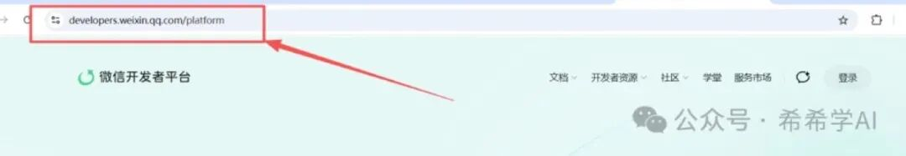
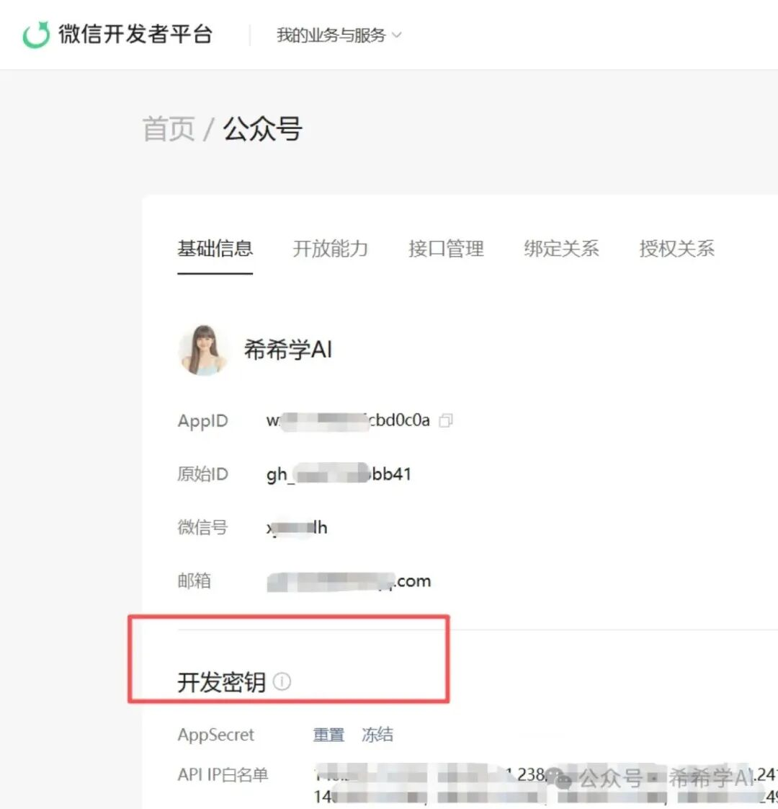
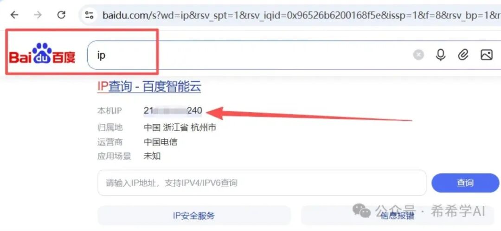

# **公众号排版推送**

> 本文来自希希学AI《**写公众号完整 SOP：从选题到发布，一篇讲透**》，原文发布于 2026 年 7 月 26 日。   

我写公众号文章已经有一段时间了。从一开始花一整天憋一篇稿子，到现在两三个小时完成从选题到推草稿的全流程，核心变化就是把每个环节都交给了QwenWork，并且把流程固定下来。

今天把这套  SOP  完整写出来。不是泛泛而谈"AI 能帮你写文章"，而是每一步具体怎么操作、给什么指令、注意什么坑，全部摊开讲。你照着做，当天就能跑通。

## **1\. 全流程鸟瞰**

先看一下完整链路，心里有个整体感：

**选题定方向 → 喂素材搭框架 → 初稿生成 → 润色去 AI 味 → 配图制作 → 排版推草稿 → 审阅发布**

七个环节，每个环节 千问办公 都能接住。但在跑流程之前，有一步准备工作只做一次，做完之后永久有效。很多人卡在这一步，觉得"配置"两个字就头大，其实总共就三件事，十分钟搞定。

## **2\. 准备篇：一次配置，永久有效**

把这一节想成"给 千问办公 配一把操作你公众号的钥匙"。配好之后，后面每篇文章从写完到推进草稿箱，就是一句话的事。

**第一件事：安装 md2wechat 技能。**

md2wechat 是 千问办公 的一个内置技能（skill），负责把 Markdown 文章转成微信公众号兼容的 HTML 格式，并且自动处理图片上传、样式注入。没有它，千问办公 写出来的东西只是一篇纯文本，推不进公众号。

安装方法：打开 千问办公，在对话框里输入 `/`，会弹出技能列表。搜索"md2wechat"，点击安装。装好之后，你在对话里提到"推送到草稿箱""转成公众号格式"这类话，千问办公 就会自动调用这个技能。

如果你搜不到，也可以直接跟 千问办公 说：
> 帮我安装 md2wechat 技能。   

它会引导你完成。装一次就行，不用每篇文章重复操作。

**第二件事：拿到 AppID 和**  **AppSecret****。**

这两个东西是你的公众号给 千问办公 的"授权凭证"。没有它们，千问办公 没有权限往你的草稿箱里写东西。

操作步骤：
1. 打开微信开发者平台（developers.weixin.qq.com），用管理员微信扫码登录。

微信开发者平台首页
2. 进入「公众号」→「基础信息」页面。
3. 页面上会显示你的 AppID（一串字母数字组合），直接复制。
4. 往下找到「开发密钥」一栏，点 AppSecret 旁边的「重置」按钮，管理员微信扫码确认后，会显示一串密钥。

基础信息页 - AppID 与开发密钥位置

这里有一个大坑：**AppSecret 只在重置那一刻显示一次。**  关掉页面、刷新页面，都再也看不到了。所以弹出来的时候，立刻复制，存到你本地的加密笔记里。别截图发微信群，别存云盘明文，这东西泄露了等于别人能操作你的公众号。

拿到之后，第一次推草稿时 千问办公 会主动问你要：
> 请提供你的 WECHAT\_APPID 和 WECHAT\_SECRET。   

把两串字符粘贴进去就行。千问办公 会写进本地配置文件（.env），后续自动读取，不用每次都填。

**第三件事：加 IP 白名单。**

微信的安全机制规定，只有白名单里的 IP 地址才能调用公众号 API。你的电脑出口 IP 不在白名单里，推送就会报错（错误码 40164）。

怎么加：
1. 打开浏览器，百度搜索"ip"，页面顶部会显示你的本机出口 IP（类似 140.205.11.23 这种格式）。

百度搜索 ip - 查看本机出口 IP
2. 回到微信开发者平台，「基础信息」页面往下找到「API IP 白名单」，点修改。
3. 把刚才查到的 IP 填进去，保存。

如果你的网络有固定出口（比如公司专线），填一次就完事了。但如果你用的是家庭宽带，IP 是动态的，隔几天可能变一次。表现就是：之前推得好好的，突然报 40164 错误。这时候别慌，重新百度查一下当前 IP，补进白名单就行。

**验证配置是否成功。**

三件事做完，跟 千问办公 说一句：
> 帮我测试一下公众号连接是否正常。   

千问办公 会尝试获取一次 access\_token。如果返回成功，说明钥匙配好了，后面所有推送操作都不会再卡在权限问题上。如果报错，把错误码发给它，它会告诉你具体是哪一步没配对。

整个过程，熟练的话五分钟，第一次操作大概十分钟。配一次，管很久。下面进入正式流程。

## **第一步：选题与定调**

选题是一篇文章的起点。我通常会给 千问办公 一个模糊的方向，让它帮我收敛成具体选题。

实际操作时，我会这样说：
> 我想写一篇关于 千问办公 定时任务的文章，面向公众号读者，偏实操教程风格。帮我想 3 个切入角度，每个角度给一句话标题和核心卖点。   

千问办公 会返回几个候选方向。我挑一个，再追加一句确认：
> 就第二个角度。标题定为《千问办公 自动化任务实操：把每天重复的活，交给一个不会忘事的 Agent》。读者是有一定 AI 基础但没上手自动化的职场人，篇幅 4000 字左右，干货教程风格。   

这一步的关键是把四个要素定死：**标题、读者画像、篇幅、风格**。后面所有环节都围绕这四个约束展开，不要写到一半再改方向。

如果你完全没有方向，也可以让 千问办公 帮你做选题发散。把最近想聊的几个关键词丢给它，让它用"痛点 × 场景"的矩阵排列组合，往往能碰撞出你自己想不到的角度。

## **第二步：喂素材，搭框架**

定了选题之后，我不会直接让 千问办公 开写。先喂素材。

素材来源通常有三种：

**第一种，已有文档。**  比如我之前写蓝皮书系列，原始素材就是 千问办公.homes 上的章节内容。我会把链接或文件丢给 千问办公，说：
> 读一下这份素材，提取和"自动化任务"相关的核心功能点、操作步骤、使用场景，整理成要点清单。   

千问办公 读完会输出一份结构化的素材摘要。我扫一眼，确认它理解对了。

**第二种，零散笔记。**  有时候素材是我自己用了一段时间的心得，几句话、几个截图、几条聊天记录。我会直接粘贴进对话，告诉它：
> 这是我用定时任务功能一个月的零散记录，帮我归纳成 3-5 个核心观点，每个观点配一个真实使用场景。   

**第三种，竞品或参考资料。**  如果我想参考别人怎么写的，会把链接发过去：
> 读一下这篇文章，分析它的结构和节奏，告诉我哪些写法值得借鉴，哪些不适合我的风格。   

素材喂完之后，搭框架。我会明确要求：
> 根据以上素材，帮我列一个文章大纲。要求：6-8 个章节，每章一句话概括核心内容，标注预估字数。整体节奏是"为什么→是什么→怎么做→注意事项"。   

大纲出来后我会调整顺序、合并或拆分章节。这一步花不了五分钟，但能避免后面写到一半发现结构塌了。

## **第三步：初稿生成**

框架定了，开始写正文。我的指令通常长这样：
> 按以下大纲写完整初稿。要求：   

这里有个经验：**提示词里给正面示例比给负面约束有效得多。**  与其说"不要写得太学术"，不如说"像跟同事在茶水间聊这个功能一样写"。千问办公 对风格描述的响应比对禁止清单的响应更精准。

初稿生成后，我不会逐字读，而是先快速扫三件事：结构是否跟大纲一致、有没有明显的 AI 八股段落（比如每段开头都是"首先/其次/最后"）、关键信息有没有遗漏。大问题标出来，统一修改。

## **第四步：润色，去 AI 味**

这是整条链路里我最看重的一步。AI 写的初稿，信息密度够，但读起来总有一股"机器味"——句式整齐得过分、转折词滥用、每段结尾都要升华一下。

我的做法是分两轮处理。

**第一轮：结构润色。**  把初稿发给 千问办公，指令是：
> 以专业编辑视角审读这篇文章，只改结构和节奏，不改内容。具体做：   

**第二轮：语言润色。**  结构没问题了，再磨句子：
> 逐段润色，要求：   

两轮下来，文章读起来就像人写的了。如果你追求更高的个人风格辨识度，还可以把自己以前写过的文章喂给 千问办公，让它提取你的文风特征（用词偏好、句式习惯、段落节奏），然后按这个指纹去润色。

## **第五步：配图制作**

公众号文章没有配图，阅读体验会差很多。我的配图分两类：封面和信息图。

**封面图。**  我固定用清新科技插画风，带 千问办公 的蓝绿色吉祥物。指令模板：
> 生成一张公众号封面图，16:9 比例。风格：清新科技插画，扁平化。画面元素：一只薄荷绿（#6db89c）和天蓝（#4a9fd9）配色的圆润吉祥物，正在操作一个自动化齿轮/流水线。背景干净，留白充足，左侧放标题文字"XXXXX"。不要出现英文。   

封面图的关键是**标题文字要入图**，而且生成后一定要肉眼检查中文有没有乱码或错字。AI 生图对中文的还原度还不是百分百，错一个字发出去就很尴尬。

**正文信息图。**  文章里每个核心章节，我会配一张信息图来总结要点。比如讲"自动化任务五要素"，就做一张五要素的结构图。指令：
> 生成一张 3:4 竖版信息图。主题：千问办公 自动化任务的五个关键要素。风格：深色科技风，信息图表。内容包含：触发条件、执行频率、任务内容、异常处理、结果通知，每个要素配一个图标和一句话说明。所有文字用中文。   

信息图生成后，我同样会逐张检查文字准确性。如果有错，直接告诉 千问办公 哪里不对，让它重新生成。通常一两次就能修好。

一篇文章我一般配 4-6 张图：1 张封面 \+ 3-5 张正文信息图。不要贪多，图太多反而打断阅读节奏。

## **第六步：排版与推草稿**

文章和图都好了，最后一步是排版并推到微信公众号草稿箱。

我用的排版工具是 md2wechat，它能把 Markdown 直接转成微信公众号兼容的 HTML 格式，并且自动处理图片上传。整个操作 千问办公 可以帮我一键完成：
> 把这篇文章转成微信公众号格式，用 default 主题。封面图用刚才生成的封面。作者署名"牧之野"。摘要用文章第一段。转好之后推到草稿箱。   

千问办公 会在后台执行格式转换、图片上传、草稿推送，全程不用我手动操作。

这一步有几个注意事项，都是踩坑踩出来的：

**图片格式。**  微信对图片有格式要求，本地图片需要先转成 JPEG 再上传。千问办公 会自动处理这个转换，但如果你自己手动操作，记得用 JPEG 而不是 PNG。

**代码块。**  微信公众号的草稿 API 会吞掉深色高亮代码块。如果你的文章里有指令示例或提示词模板，用引用块格式（就是每行前面加  `>`）而不是代码围栏。这样在微信里显示正常，也不会被 API 过滤掉。

**表格。**  Markdown 表格转成微信格式后，在窄屏手机上多列会挤在一起。如果表格超过三列，建议拆成多个小表格，或者改成行内文字描述。

**标题序号。**  default 主题会自动给 h2 标题加"1. 2. 3.“序号，给 h3 加"x.y"序号。所以你在 Markdown 里不要自己手写"一、”"二、"这种序号，否则会出现"1. 一、选题"这种重复。

## **第七步：审阅与发布**

推到草稿箱之后，不要急着发。我固定会做三件事：

**第一，手机端预览。**  在公众号后台点"预览"，发到自己的微信上，用手机完整看一遍。重点看：图片有没有裂、排版有没有错位、信息图上的文字在手机上能不能看清。

**第二，朗读检查。**  把文章从头到尾默读一遍。凡是读着拗口的地方，一定是句式有问题。这一步能抓住很多"语法正确但读着别扭"的 AI 残留。

**第三，核对事实。**  文章里提到的功能名称、操作路径、参数设置，逐一对照实际产品确认。AI 有时候会"编造"一个不存在的按钮或设置项，这种错误发出去很伤公信力。

三件事都过了，定时发布或者立即推送。

## **时间分配参考**

跑熟之后，我一篇 4000 字文章的时间分配大概是：

选题定调 10 分钟，喂素材搭框架 20 分钟，初稿生成 5 分钟（等 千问办公 输出），润色两轮 30 分钟，配图 30 分钟（含检查和重做），排版推草稿 10 分钟，审阅 20 分钟。总计大约两小时出头。

其中润色和配图最花时间，因为这两步需要人眼判断，没法完全自动化。但相比纯手写一天一篇的节奏，效率已经翻了三四倍。

## **几个让效果翻倍的习惯**

**固定你的风格锚点。**  我每次开新文章，第一段指令里都会带上"专业干货向、务实带路径、不煽情"这几个关键词。时间久了，千问办公 对你的风格会有记忆，初稿的完成度越来越高。

**建立素材库。**  平时用 千问办公 的过程中，遇到好的操作案例、踩过的坑、读者的提问，随手记下来。写文章时直接喂进去，比临时找素材效率高十倍。

**一次只改一件事。**  润色时不要同时改结构、改语言、改内容。分轮次来，每轮只聚焦一个维度。混着改容易顾此失彼，而且出了问题不知道是哪步引入的。

**配图和文字分开做。**  不要写一段配一张图。先把文字全部定稿，再统一做配图。因为文章结构在润色阶段经常会调整，如果图先做了，一改结构图就白做了。
