# **把真实任务变成 AI 工作流：一套可复用的方法论**
> 本文来自艾笑AI《具体任务怎么变成 AI 工作流？这篇讲清楚》，原文发布于 2026 年 7 月 21 日。   

面对一批历史资料，真正的起点不是选工具，而是让一个真实任务先长出最小、可验证的工作流程。

昨天社群里问了一个很典型的问题。

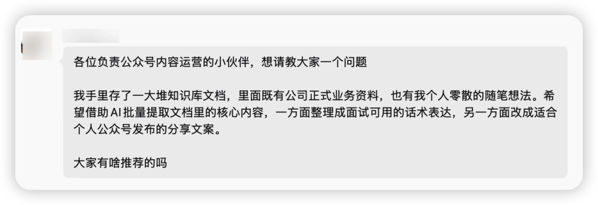

手里有一批历史资料：既有公司的正式业务文档，也有自己零散记录的思考。希望借助 AI，把这些资料加工成两类成果——

一类用于面试，把过去做过的项目、解决的问题和形成的能力，整理成能讲清楚的表达；另一类用于公众号，从同一批资料里提炼选题、观点和文章。

在社群里做了概要的回答，比较琐碎，并且篇幅有限。因为这个案例比较典型，所以单独写篇文章，来说明一下这个工作的流程和思路。


这个需求听起来像"让 AI 批量总结文档"。但如果真的开始做，很快就会遇到一串问题：资料应该怎么分类？面试和写文章需要的是同一种摘要吗？文档太多，上下文放不下怎么办？以后还有新资料进来，难道每次都重跑一遍？什么时候应该写 Skill？

很多人会立刻开始选工具：导出到本地、放进 Obsidian、搭知识库、做 RAG，或者直接让多个 Agent 并行读取。

这些都可能用到，但都不是第一步。

AI Native 的开工方式，是先把模糊需求变成可执行、可验证、可扩展的工作过程。

这篇文章不讨论某一个工具谁更强。我会把这个真实需求完整拆开，展示它怎样从一个小 Skill 起步，经过小样 MVP 验证，再扩展到历史资料批处理、未来资料增量处理，最后形成一组能重复使用的 Agent 工作流。

## 01 先别看工具：把需求画成"一份素材，两个输出"

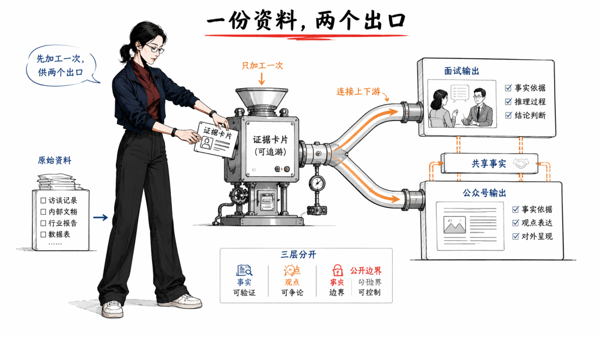

拿到需求后，我不会先问"资料放在哪里"，而会先问两个问题：原始素材是什么，最终要交付什么。

在这个案例里，任务的最小模型是：
```text
一批历史资料
　　↓
结构化的事实与证据
　　├── 面试材料
　　└── 公众号内容
```

这里最重要的不是"两个输出"，而是中间那层"结构化的事实与证据"。

如果让 Agent 直接从原始资料生成面试回答，它容易把项目事实改写得过度漂亮；如果直接生成公众号文章，又容易混淆公司事实、个人观点和可公开内容。

因此，两个输出不能各自重新读取全部原文。它们应该共享一层经过加工的中间资产，我把它叫作"证据卡片"。

一张证据卡片至少要回答：
- 这段信息来自哪篇文档？
- 它属于哪个项目或主题？
- 我在其中扮演了什么角色？
- 我做了什么，产生了什么结果？
- 哪些是原文事实，哪些是个人判断？
- 它能否用于面试？能否公开写进文章？
- 如果不能确认，应该标记什么疑点？

面试 Skill 消费证据卡片，公众号 Skill 也消费证据卡片。两条工作流可以有不同目的，但不再各自发明事实。

一份资料底座，两个业务出口，中间用可追溯的证据层连接。

这一步就是工作流思维：先从交付物反推中间产物，再从中间产物反推原始资料应该怎样加工。
> 任务模型已经有了，但它仍然只是一张图。下一步不是把图画得更复杂，而是让它尽快跑起来——   

## 02 一开始就写一个小 Skill，把流程假设变成可执行原型

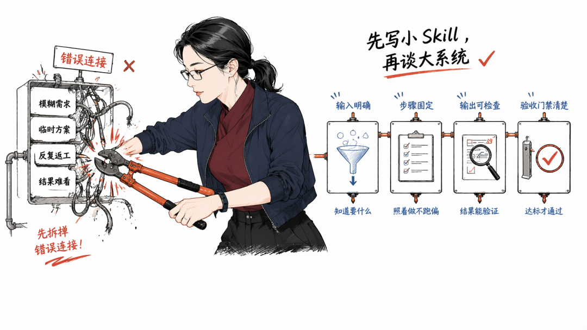

很多人把 Skill 理解成"流程成熟之后再写的说明书"。其实在早期，一个轻量 Skill 也可以是实验容器。

它不需要解决全部历史资料，也不需要自动化所有环节。它只需要把这次实验的输入、步骤、输出和验收标准写清楚，让 Agent 可以按同一方式重复跑几次。

最小可运行的"小样验证 Skill"——三分钟能填完：
```markdown
---
name: historical-doc-mvp
description: 用代表性文档验证双输出流程
---

# 输入
- 5～10 篇代表性文档
- 一个目标岗位
- 一个公众号方向
- 保密与公开边界

# 步骤
1. 建立样本文档清单。
2. 逐篇提取项目、行动、结果和观点。
3. 每条结论记录原文文件与位置。
4. 区分事实、判断和待确认信息。
5. 生成一份面试材料小样。
6. 生成一份公众号选题小样。
7. 输出失败项与字段修改建议。

# 完成标准
- 重要结论都有原文出处。
- 不把推测写成事实。
- 未经人审，不进入批量阶段。
```

这是最小起手骨架，不是最终形态。

它的价值不在于写了多少提示词，而在于第一次把模糊需求变成了一个可执行契约。

Agent 知道要读取什么、按什么顺序处理、交付什么；用户也知道应该检查什么，以及什么情况下不能继续扩大规模。

## 03 用小样本跑 MVP，不要拿全部资料赌第一次结果

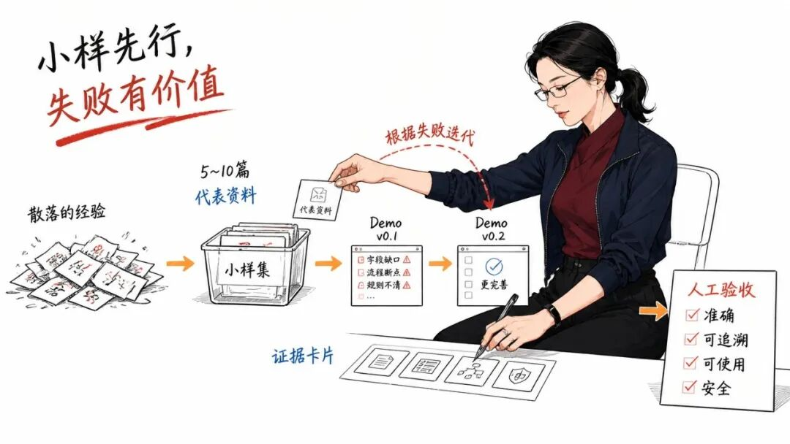

有了小 Skill，下一步不是把整个飞书知识库导出来，而是挑选一组代表性样本。

样本不能只选最整齐、最好理解的文档。一个有价值的小样本应该故意覆盖差异：公司正式材料、项目复盘、技术实践、个人随笔、内容重复的文档，以及可能含有敏感信息的材料。

假设总共有几百篇资料，第一轮可以只选 8 篇。这个数字没有神奇之处，它只是足够小，方便人工检查；又足够多，能够暴露不同资料之间的结构差异。

小样 Skill 跑完后，至少要交付四类东西。

第一，8 张结构统一的证据卡片。第二，一份面试 Demo，例如从某个项目生成一段 STAR 表达。第三，一份内容 Demo，例如生成三个公众号选题和其中一个大纲。第四，一份失败清单，记录哪些字段提取不到、哪些分类含义重叠、哪些内容不能公开。

这时不要先看文章写得是否漂亮，而要做四项验收。

| 验收维度 | 要回答的问题 | 不通过怎么办 |
|------------|------------------|------------------|
| 准确性 | 是否忠于原文 | 修改提取规则 |
| 可追溯 | 能否找到出处 | 强制证据字段 |
| 可使用 | 能否服务真实输出 | 调整中间结构 |
| 安全性 | 是否越过保密边界 | 增加权限与脱敏 |

例如，面试 Demo 如果只能描述"参与了某项目"，却无法讲清个人职责，就说明证据卡片缺少"角色"和"关键行动"；公众号大纲如果都是公司介绍，没有个人判断，就说明提取阶段没有区分"正式事实"和"个人观点"。

这些问题不是失败，而是小样 MVP 最重要的产物。

Skill 的第一个版本不是为了证明自己正确，而是为了尽快暴露流程哪里不完整。

根据验收结果，把 historical-doc-mvp 从 v0.1 改到 v0.2，再用另外几篇资料复跑。直到不同类型的样本都能稳定形成证据卡片，才说明"单篇资料怎么加工"这件事基本跑通了。
> 到这里，我们只证明了一件事：这条生产线能够加工一小批资料。接下来才轮到真正的规模问题——   

## 04 MVP 通过后，再分开处理"海量"与"持续"

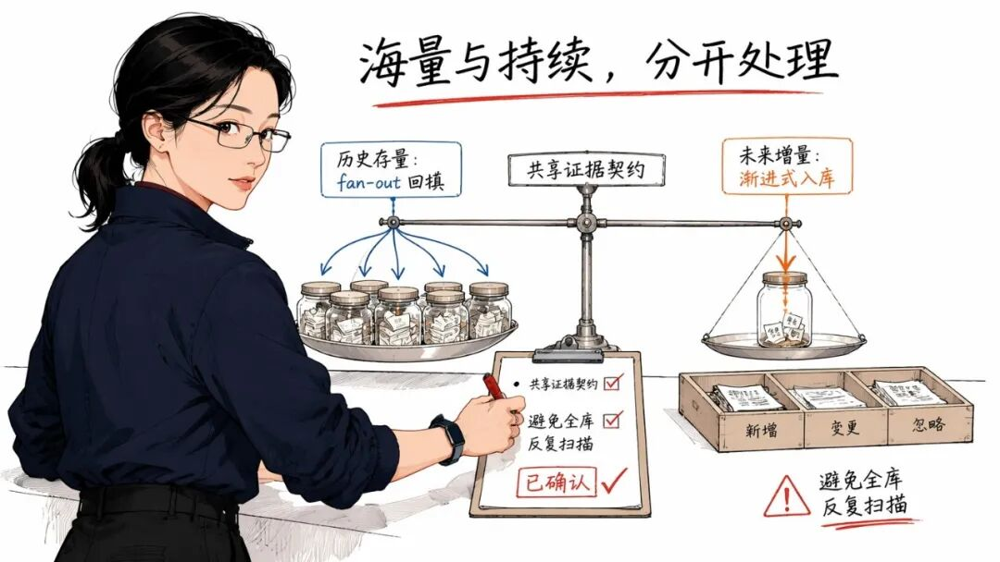

海量和持续看起来都在说"资料很多"，实际上是两种不同问题。

海量是存量问题：过去已经积累了几百篇资料，怎样在有限上下文里一次性回填？持续是增量问题：以后每周仍有新资料进来，怎样不扫描全库，也能进入同一套结构？

它们不能共用一个粗暴的"全部重跑"按钮，但可以复用刚才验证过的证据卡片契约。

### （一）历史存量：用 fan-out 复制已经验证的小 Skill

当单篇提取规则稳定以后，fan-out 才真正有价值。

它不只是并行提速，还能把不同批次的原文放进多个子 Agent 的独立上下文，避免一个 Agent 读取全部资料后上下文撑爆。

但 fan-out 不能让每个子 Agent 自由总结。正确做法是把同一个"小样提取 Skill"复制给它们：每个 Agent 处理一小组文档，必须返回同样的证据卡片，并限制摘要长度；主 Agent 只接收结构化结果，负责去重、合并和失败重试。
```markdown
---
name: historical-doc-backfill
description: 批量回填已验证的历史资料
---

# 前置门禁
- 小样 Skill 已通过人工验收
- 证据卡片字段已经冻结

# 步骤
1. 生成完整文件清单和唯一编号。
2. 按目录与上下文预算分组。
3. 每组调用同一单篇提取 Skill。
4. 校验字段、出处和失败状态。
5. 汇总证据卡片并建立索引。
6. 失败文档单独重试，不重跑全库。

# 输出
- manifest.md
- evidence-cards/
- index.md
- failures.md
```

这个批处理 Skill 的核心不是"启动多少个 Agent"，而是确保所有 Agent 执行同一个已经通过验证的加工标准。

小 Skill 定义怎样处理一份资料，fan-out 负责把这个能力安全地复制到大量资料上。

如果没有前面的小样测试，fan-out 只会更快地产生一批格式不一、无法验收的摘要。

### （二）未来增量：用渐进式入库避免重复扫描

历史资料回填完成后，不能每来一篇新文档就再次读取几百篇旧文档。

增量流程应该只处理"新出现或发生变化"的资料：读取新文档的元数据和正文，生成证据卡片，更新索引，再标记它可能影响哪些面试主题或公众号选题。
```markdown
---
name: historical-doc-ingest
description: 渐进处理新增或变更的资料
---

# 输入
- 一篇新增或修改后的文档

# 步骤
1. 记录来源、时间和保密级别。
2. 调用单篇资料提取 Skill。
3. 更新对应证据卡片。
4. 更新主题与项目索引。
5. 标记受影响的下游输出。
6. 出现新模式时提出规则变更建议。

# 门禁
- 不扫描无关历史全文。
- 不自动公开公司敏感信息。
- 不因一篇特例随意新建 Skill。
```

这里的"渐进式"不是给文档加几个 tag 就结束。Agent 必须遵守明确的读取顺序：先查索引，定位候选资料，真正需要时再打开原文。

同样，也不建议每进来一篇资料就"自动做一个新 Skill"。新资料应该自动调用已有 Skill；只有某种新判断、新动作连续重复出现，旧 Skill 已经无法稳定覆盖时，系统才提出新增或修改 Skill 的建议，再由人确认。

## 05 两个输出不是终点，而是两条下游生产线的入口

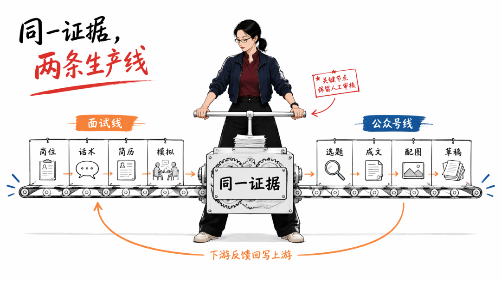

完成素材加工后，面试和公众号不能被塞进同一个大提示词。它们虽然使用同一批事实，验收标准却完全不同。

但如果工作流只停在"面试 Skill"和"公众号 Skill"，仍然不完整。真实业务不会在生成一份材料时结束：面试材料还要进入简历和模拟训练，公众号选题还要进入成文、排版、配图和草稿同步。

因此，更准确的设计是把它们看成两条下游生产线。

### （一）面试线：从证据卡片走到虚拟面试官

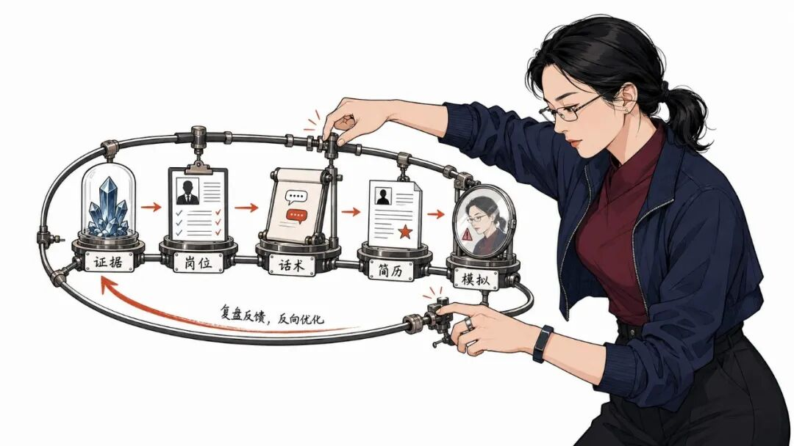

面试线的目的不是生成一份听起来流畅的标准答案，而是让岗位要求、个人证据、口头表达和简历表述保持一致。

它至少需要四个可独立测试的小 Skill。

| Skill | 输入 | 核心输出 | 人审门禁 |
|-----|------|------------|------------|
| 岗位匹配 | JD、证据卡片 | 能力矩阵 | 不虚构匹配 |
| 面试话术 | 能力矩阵、项目证据 | 多版本回答 | 每句可回查 |
| 简历迭代 | 母版简历、目标岗位 | 岗位版简历 | 保留差异记录 |
| 虚拟面试官 | JD、话术、简历 | 模拟与评分 | 问题回写上游 |

第一步是岗位匹配。Agent 读取目标岗位说明，把岗位要求拆成能力项，再从证据卡片中寻找真实项目支撑。没有证据的能力只能标记为缺口，不能为了"匹配度"自动补造经历。

第二步是面试话术。它不能只生成一套长答案，而应该为同一段经历准备不同长度：30 秒回答负责先讲结论，90 秒回答展开关键行动，深入版回答用于技术追问或业务复盘。每个版本都要指向同一组证据。
```markdown
---
name: interview-script
description: 把项目证据转成可追问的面试话术
---

# 输入
- 目标岗位能力矩阵
- 已审核的项目证据卡片

# 步骤
1. 选择一个岗位能力与项目案例。
2. 生成 30 秒结论版回答。
3. 生成 90 秒 STAR 版回答。
4. 生成深入追问与证据提示。
5. 标记无法由原文支持的表述。

# 输出
- 话术正文
- 追问清单
- 证据链接
```

第三步是简历版本迭代。系统应保留一份事实稳定的母版简历，再针对不同岗位生成强调重点不同的版本。变化的应该是排序、篇幅和岗位语言，不是经历本身。每次迭代要留下差异记录，方便人判断"为什么改"和"改得是否过度"。

第四步是虚拟面试官模拟。虚拟面试官根据目标岗位、简历版本和话术逐题追问，一次只问一个问题；回答后分别评价事实准确性、结构清晰度、岗位相关性和追问承受力。

模拟的价值不只是打分。它会暴露三类真实问题：证据不足，说明要回到资料层补充；表达混乱，说明要修改面试话术；简历承诺过强，说明要收缩岗位版简历。
```text
证据卡片 → 岗位匹配 → 面试话术
　　　　　　　　　　　　 ↓
母版简历 → 岗位版简历 → 虚拟面试官
　　  ↑　　　　  ↑　　　　   ↓
　　  └────── 复盘与修正 ──────┘
```

面试工作流不是"生成答案"，而是用模拟暴露问题，再让证据、话术和简历一起迭代。

### （二）公众号线：从选题走到可审核的公众号草稿

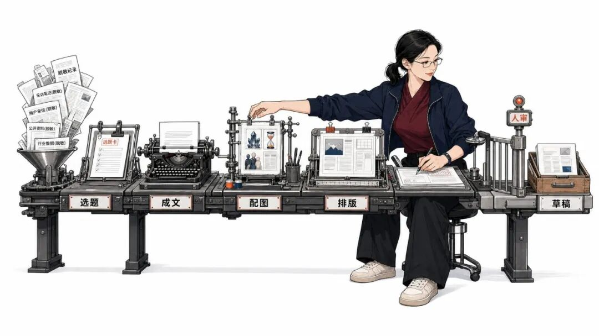

公众号线追求的是读者价值、个人观点和公开安全。它需要从可公开证据中寻找问题与冲突，生成选题，再把正式事实和个人思考组织成文章，而不是把公司资料换个说法直接发布。

选题完成也不是终点。它后面至少还有成文、风格、排版、配图和草稿同步。

| Skill | 输入 | 核心输出 | 人审门禁 |
|-----|------|------------|------------|
| 证据转选题 | 脱敏证据、目标读者 | 候选选题 | 检查公开边界 |
| 风格与模板 | 作者样文、文章类型 | 写作契约 | 不新增事实 |
| 正文成文 | 选题、证据、写作契约 | 长文初稿 | 回查原始证据 |
| 公众号配图 | 已审核正文、视觉方向 | 图位与图片 | 检查图文一致 |
| 公众号排版 | 正文、图片、主题 | 可预览 HTML | 校验移动端 |
| 草稿同步 | HTML、封面、摘要 | 公众号草稿 | apply 前确认 |

"风格与模板 Skill"负责描述文章怎么写，例如开头用故事还是问题，章节如何推进，句子长短、第一人称比例和禁用表达是什么。它只能决定表达方式，不能绕过证据层增加新事实。

"正文成文 Skill"再用选题、证据卡片和写作契约生成初稿。初稿通过事实和公开边界检查后，才进入配图。配图 Skill 先识别哪些位置真的需要图，再规划故事画面、流程图、知识卡片或金句图，生成后把图片回填到对应位置。

图片确定后，公众号排版 Skill 把 Markdown、图片和主题组件转换为适合微信编辑器的 HTML，并检查标题层级、段落长度、图片尺寸和移动端预览。

最后由草稿同步 Skill 做 dry-run，展示标题、摘要、封面、正文长度和图片处理结果。只有用户确认后，才创建公众号草稿；这里的自动化止于草稿箱，不应该绕过人审直接发布或群发。
```markdown
---
name: content-to-wechat
description: 编排选题到公众号草稿的生产链
---

# 输入
- 已脱敏的证据卡片
- 目标读者与内容方向
- 作者风格与文章模板

# 步骤
1. 调用证据转选题 Skill。
2. 人工确认选题与公开边界。
3. 调用风格模板和正文成文 Skill。
4. 人工审核事实、结构和表达。
5. 调用配图与公众号排版 Skill。
6. 草稿同步只执行 dry-run。
7. 用户确认后创建公众号草稿。

# 禁止
- 不把公司敏感材料直接改写发布。
- 不未经确认自动发布或群发。
```

公众号线同样存在回流：如果排版发现结构过长，要回到正文调整；如果配图找不到合适图位，可能说明文章结构还不够清楚；如果后续阅读反馈显示选题和读者需求错位，就要修正选题规则和风格模板。

两个业务出口的共同上游都是证据卡片，但一个面向"如何可信地证明我能做什么"，另一个面向"如何安全地把经验转化为读者价值"。

这样拆开以后，任何一个环节需要修改，都不必重新加工全部原始资料。
> 当小样、存量、增量和两个业务出口都能独立运行时，完整工作流才真正浮现出来。最后的大 Skill 不是吞掉它们，而是负责把它们编排起来——   

## 06 最后的大 Skill，只负责判断与编排

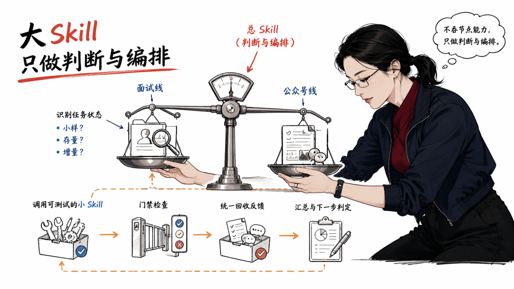

整个系统稳定以后，可以再写一个更大的编排型 Skill。

它接到任务后，先识别用户要处理的是小样、历史存量还是新增资料；再判断目标是面试、公众号，还是两者都要；随后调用对应小 Skill，并在关键节点停下来让人验收。

完整结构可以画成这样：
```text
真实需求
  ↓
小样验证 Skill
  ↓
证据卡片契约
  ├── 历史存量：fan-out 回填 Skill
  └── 未来增量：渐进式入库 Skill
　　　　　　　　↓
　　　　　　 证据索引
　　　　  ┌──────┴──────┐
　　　　  ↓　　　　　　 ↓
　　   面试线　　　　 公众号线
  岗位匹配　　　　  证据转选题
　　  ↓　　　　　　　　 ↓
  面试话术　　　　  风格与成文
　　  ↓　　　　　　　　 ↓
  简历迭代　　　　  配图与排版
　　  ↓　　　　　　　　 ↓
  虚拟面试官　　　　草稿同步
　　　　  └──────┬──────┘
　　　　　　　　 ↓
　　　　   人工审核与反馈
　　　　　　　　 ↓
　　　　回写证据、模板与规则
```

总 Skill 负责选择路径、传递输入、检查前置条件和汇总结果。具体怎样提取文档、怎样生成话术、怎样迭代简历、怎样写文章、排版或配图，仍由各自的小 Skill 负责。

这就避免了一个常见问题：把所有规则都塞进一个巨大 Skill，最后任何一步变化都牵动整个系统。

小 Skill 是可测试的能力单元，大 Skill 是理解任务并组织能力的调度者。

## 07 这套方法为什么称得上 AI Native

传统自动化通常从"把现有步骤搬进脚本"开始。AI Native 的不同之处，是它可以先用一个轻量 Skill 承载尚未完全确定的流程，再通过真实样本、人工验收和失败记录，让流程逐渐成形。

在这个案例里，Skill 同时经历了三种角色。

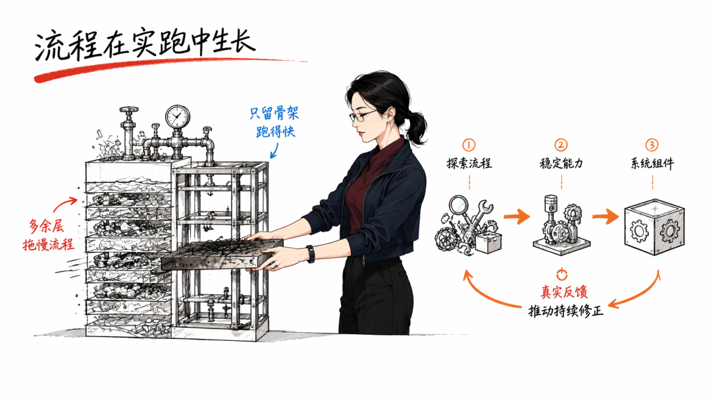

**第一阶段｜探索工具。** 我们用 historical-doc-mvp 验证哪些字段有用，两个输出真正需要什么。

**第二阶段｜稳定能力。** 单篇提取通过测试后，存量回填和增量入库分别成为独立 Skill；面试与公众号则继续拆成话术、简历、模拟、成文、排版、配图和草稿同步等能力单元。

**第三阶段｜系统组件。** 一个总 Skill 根据任务状态调用这些能力，并把模拟和发布阶段的反馈送回上游，把一次性的解决方案变成长期可复用、能够自我修正的工作系统。

整个过程不是简单地把步骤排成一条直线，而是一个持续反馈的整体：输出目的决定素材怎么加工；小样结果修正 Skill；稳定 Skill 决定 fan-out 如何拆分；增量资料又会暴露新的分类与业务需求。

AI Native 不是把工作全部交给 AI，而是让任务、流程、证据、验收和复用能力一起生长。

## 08 这不只是资料处理：任何任务都可以这样开始

这篇文章用"历史资料怎样变成面试材料和公众号内容"做案例，但这套方法并不只适用于资料处理。

你手头的任何一个真实任务——做调研、写报告、跟进客户、准备课程、复盘项目，或者持续生产内容——都可以借鉴同一条路径，把一次性的"让 AI 帮我做"，逐步变成真正的 AI Native 工作流：
```text
真实任务 → 明确交付 → 最小样本 → 小 Skill
　　　　→ Demo → 人工验收 → 批量或持续处理
　　　　→ 多个小 Skill 协作 → 总 Skill 编排与反馈
```

真正的 AI 工作流，不是先画一张宏大的系统图，也不是把所有步骤一次性交给 Agent。它应该从一个能完成、能检查、能复跑的小闭环开始，再根据真实结果决定下一步长什么。

如果你想今天就开始，不需要先掌握复杂的多 Agent 编排，也不需要一次写出完整系统，只做下面四件事。

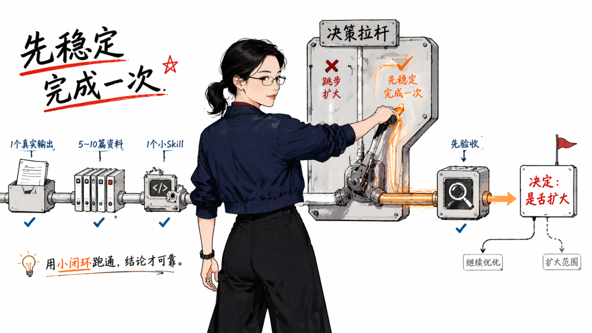

**1｜锁定一个可验收的真实输出。** 把目标写成一个可以检查的交付物，例如一段 90 秒面试回答，或者 3 个可以继续写的公众号选题。

**2｜挑选一组最小但有代表性的样本。** 选 5～10 个覆盖正常、边界和失败情况的输入，不求多，只求能够暴露问题。

**3｜写一个只跑最小闭环的小 Skill。** 只写清输入、步骤、输出和验收标准，让同一组样本能够按相同规则重复执行。

**4｜跑出 Demo，并由人完成第一次验收。** 检查结果是否准确、可追溯、可使用且安全，再根据失败项修改流程。

四件事做完，你就有了一个可运行、可检查、可修改的最小闭环。数据多了再做批量，持续新增再做增量，重复动作稳定后再拆成更多 Skill。

这套方法不只适用于资料处理。做调研、写报告、跟进客户、准备课程、复盘项目或持续生产内容，都可以从这四步开始。

先用小 Skill 跑通最小闭环，再让工作流随着真实问题逐步长大。


